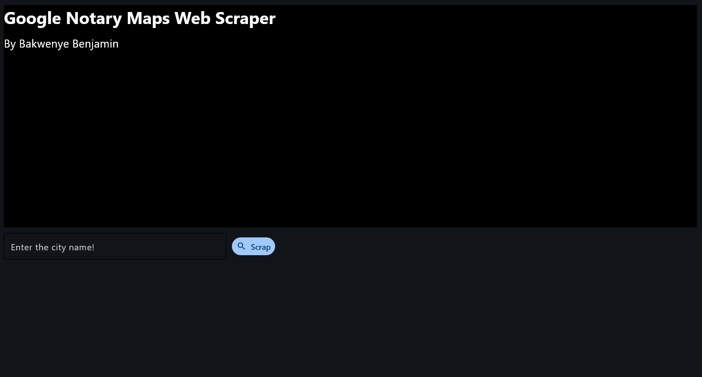

# Google-maps-data-scraper


A simple desktop app to scrape contact information for **notaries in Spain** from Google Maps using Selenium. Built with [Flet](https://flet.dev) for an easy-to-use graphical interface. 

---

## ✨ Features

- Scrape business name, address, phone number, website, rating, reviews, geolocation, and screenshots.
- Works city-by-city across Spain.
- Export results to CSV.
- Friendly GUI — no coding knowledge required!

---

## 🚀 How to Run

### 1. Install Python dependencies:
First we have to create an environment using this command.
```bash
conda create -n myenv python=3.10
conda activate myenv
```
change "myenv" to your desired environment name. 
Then install the required packages with pip.
```bash
pip install -r requirements.txt
```

### 2. Download the correct ChromeDriver
Make sure ChromeDriver matches your browser version. Download it [here](https://googlechromelabs.github.io/chrome-for-testing/) and store in the folder "chromedriver-win64".   
Note, each chromedriver is connected to your chrome version. 


### 3. python app.py
Run the app and follow the instructions in the GUI.
- open your terminal
- navigate to your project folder with code 
``` bash
cd "path_to_your_project_folder"
```
- activate your environment
```bash
conda activate environment_name
```
- run the app
```bash
python app.py
```


### 4. 📁 Output
The output will be CSV files per city (e.g. Blanes.csv) in the folder scrape_files and screenshots saved under screenshots/<city>/.

### 👨‍💻 Author
Built by Bakwenye Benjamin

### Disclaimer
This project is for educational purposes. Be respectful of website usage policies and avoid scraping at high volumes.
